<p align="center">
  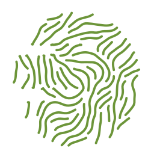
</p>

<h1 align="center">blazon</h1>

<p align="center">
  <em>The mark above is blazon's own version, drawn by blazon.<br>
  It changes with every release.</em>
</p>

<p align="center">
  <a href="https://github.com/timzifer/blazon/actions/workflows/ci.yml"></a>
  <a href="https://pkg.go.dev/github.com/timzifer/blazon"></a>
  <a href="LICENSE"></a>
</p>

Identicons for version numbers, in Go.

Not a general-purpose hash-to-picture library pointed at a version string. The
version's structure is the input: major, minor and patch feed separate entropy
streams, so how much two neighbouring releases resemble each other is a
decision you make, not an accident of the hash.

And distinguishability is a test, not a claim. Every renderer is measured
across a corpus of 184 versions, and a change that makes patch bumps harder to
tell apart turns the build red.

**No dependencies.** Standard library only — including the rasteriser and the
font. Those are the two things that decide what the pixels are, and a library
whose whole premise is that a version always produces the same mark cannot
outsource them: a dependency that sharpened its anti-aliasing would change
every mark ever generated, arriving as a routine version bump. A test enforces
it.

```go
import "github.com/timzifer/blazon"

svg, err := blazon.SVG("1.4.2", blazon.Options{})
png, err := blazon.PNG("1.4.2", blazon.Options{Renderer: "flowfield", Size: 512})
txt, err := blazon.Text("1.4.2", blazon.Options{Renderer: "bishop"})
```

```
go install github.com/timzifer/blazon/cmd/blazon@latest

blazon 1.4.2                        # terminal
blazon 1.4.2 -r flowfield -o x.svg
blazon dist -r superformula         # the distance histogram behind the thresholds
```

## How it works

Three stages. Each one is a seam you can cut at.

**1 — Entropy.** Not `sha256("1.4.2")` in one piece. Four separated streams:

```
h0 = hash(major)                      archetype
h1 = hash(major, minor)               variant
h2 = hash(major, minor, patch)        detail
h3 = hash(full version)               prerelease
```

Fields are length-prefixed, so `1.23.4` and `12.3.4` cannot collide.

**2 — Parameter mapping.** A `Renderer` draws its parameters from those streams
and decides what the mark *means*. This is the stage that determines whether
the library is useful.

**3 — Render primitives.** A `canvas.Canvas` turns drawing calls into SVG,
pixels or terminal cells. This stage decides only how it looks. Every renderer
works on every back end.

## Policy: how related should neighbours look?

An API choice, not a design decision:

| Policy | Effect |
| --- | --- |
| `PolicyFamilyAmplified` (default) | Major sets the archetype, minor the variant, patch the detail — and each renderer routes two or three of its highest-contrast parameters through the patch stream, so adjacent patches stay in the family but are never hard to tell apart. |
| `PolicyFamily` | The plain cascade. Patch changes only fine detail. |
| `PolicyIndependent` | Every stream comes from the full version. Neighbours look unrelated: maximum distinguishability, no family information. |

A prerelease never changes the core streams: `1.0.0-rc.1` still reads as a
`1.0.0`, marked by a small band of dots.

## The testable invariant

This is the part that separates blazon from any identicon port.

Marks are rendered across a version corpus, reduced to a 128-bit perceptual
hash — a DCT hash plus a difference hash, because either alone confuses shapes
the other separates — and the Hamming distances between related versions are
held to per-renderer thresholds:

```go
blazontest.Suite{
    Renderer:   myRenderer,
    Thresholds: blazontest.Thresholds{MinPatch: 6, MinMinor: 9, MinMajor: 20, Floor: 2},
}.Run(t)
```

The suite checks:

- **patch, minor and major neighbours** clear their minimum distances;
- **no pair anywhere** in the corpus falls below the global floor;
- **family cohesion** — versions sharing a major really are closer to each
  other than to other majors, so the family policy is not a lie;
- **prereleases stay close** to their release, bounded from above rather than
  below;
- **uniqueness** — no two versions render to the same bytes, exactly rather
  than perceptually;
- **determinism** — the same version renders identically, byte for byte where a
  renderer declares it can.

Measurement is monochrome on purpose. A luminance-based hash scores two marks
differing only in hue as identical, so measuring in colour would credit colour
for distinctness the form does not have. Judging form alone makes the guarantee
hold in print, in a monochrome terminal, and for a colour-blind reader.

Thresholds are calibrated from each renderer's own histogram, not guessed:

```
blazon dist -r truchet
```

## Renderers

| Name | What it is |
| --- | --- |
| `superformula` | Gielis' superformula, drawn from curated shape families — star, flower, gear, crystal, leaf, shield. The default. |
| `flowfield` | Streamlines through a Sherlock–Monro orientation field with fingerprint cores and deltas. Arch, loop and whorl come from the major version; minutiae emerge from the ridge spacing rule. |
| `truchet` | Truchet tiles. Arcs meet at cell edge midpoints, so the marks join across the grid into loops and labyrinths. |
| `polar` | A bitmap in rings and sectors instead of rows and columns, mirrored across a fold from the archetype stream. |
| `cistercian` | Medieval numerals: one stave per version component, four digits per stave. Legible — you can read the version back out of it. |
| `bishop` | The drunken bishop walk from OpenSSH randomart, for the terminal. |

## Output

- **SVG** — plain string building, deterministic number formatting.
- **PNG** — anti-aliased by exact area coverage: each edge deposits the signed
  area it sweeps per pixel column, and a running sum along the row gives
  coverage. Filling a shape and summing the alpha returns its geometric area,
  which is how the anti-aliasing is tested.
- **Terminal** — half-block characters give each cell two square pixels, so
  vector renderers arrive as pictures rather than as ASCII art. Falls back to a
  density ramp under `NO_COLOR`.

Colour is derived in OKLCH with gamut mapping, held in a lightness band that
keeps contrast on both a white page and a dark terminal.

## Gallery

Generated by `blazon gallery` and verified in CI: if the committed images stop
matching what the code renders, the build fails.

<!-- gallery:start -->

<!-- Generated by `blazon gallery`. Do not edit by hand. -->

### bishop

Terminal renderer on a 17×10 character grid.

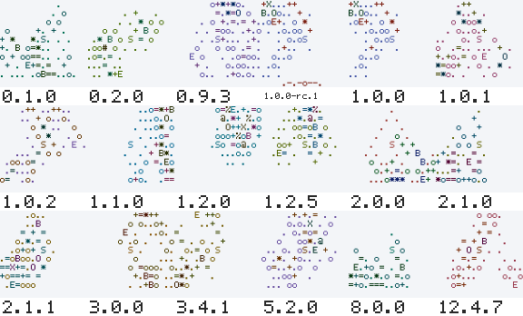

Family: `1.0.0` → `1.0.1` → `1.0.2` → `1.1.0` → `2.0.0`

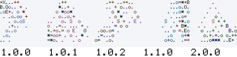

### cistercian

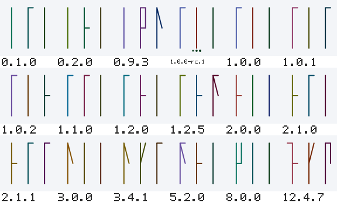

Family: `1.0.0` → `1.0.1` → `1.0.2` → `1.1.0` → `2.0.0`

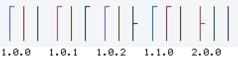

### flowfield

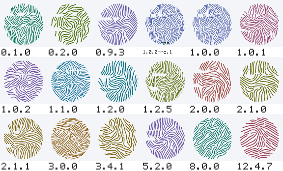

Family: `1.0.0` → `1.0.1` → `1.0.2` → `1.1.0` → `2.0.0`

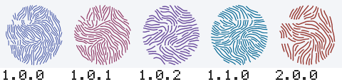

### polar

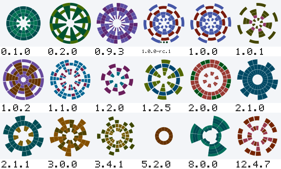

Family: `1.0.0` → `1.0.1` → `1.0.2` → `1.1.0` → `2.0.0`

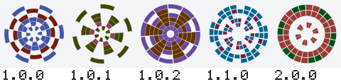

### superformula (default)

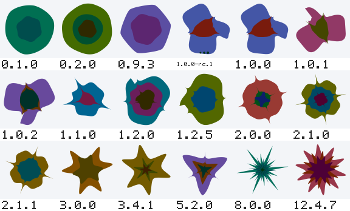

Family: `1.0.0` → `1.0.1` → `1.0.2` → `1.1.0` → `2.0.0`

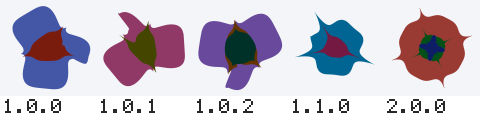

### truchet

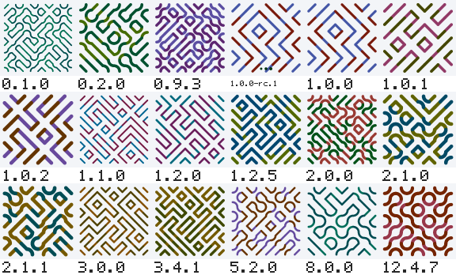

Family: `1.0.0` → `1.0.1` → `1.0.2` → `1.1.0` → `2.0.0`

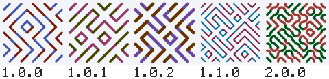

<!-- gallery:end -->

## Contributing

A new renderer needs an entry in the threshold table and has to pass
`blazontest.Suite`; see [CONTRIBUTING.md](CONTRIBUTING.md) for how to calibrate
one.

## License

MIT.
