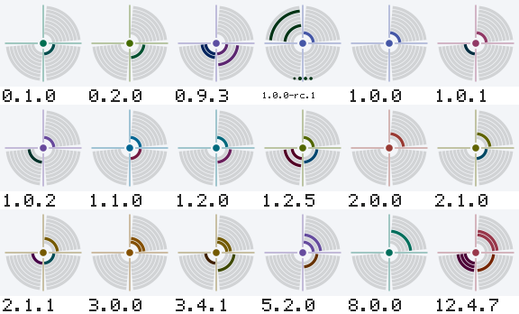
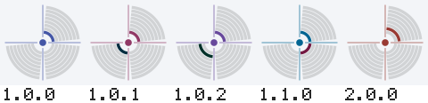
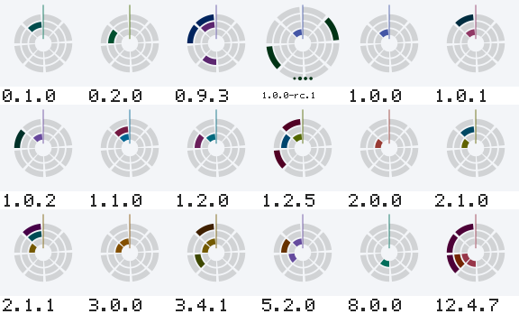
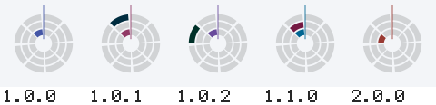

# Renderers

Every renderer works on every back end — SVG, PNG and terminal. Pick one with
`Options{Renderer: "name"}` or `blazon -r name`.

| Name | What it is | Readable? |
| --- | --- | --- |
| `superformula` | Gielis' superformula, drawn from curated shape families — star, flower, gear, crystal, leaf, shield. The default. | no |
| `flowfield` | Streamlines through a Sherlock–Monro orientation field with fingerprint cores and deltas. Arch, loop and whorl come from the major version; minutiae emerge from the ridge spacing rule. | no |
| `truchet` | Truchet tiles. Arcs meet at cell edge midpoints, so the marks join across the grid into loops and labyrinths. | no |
| `polar` | A bitmap in rings and sectors instead of rows and columns, mirrored across a fold from the archetype stream, with a centre device in the hole. | no |
| `cistercian` | Medieval numerals: one stave per version component, four digits per stave. | yes |
| `dial` | One quadrant per component, the value written in binary as radial bands. The separator is the angle: the spokes are the dots of the version string. | yes |
| `orbit` | One ring per component, major innermost, the value written in binary as cells running clockwise from noon. The separator is the radius. | yes |
| `bishop` | The drunken bishop walk from OpenSSH randomart, for the terminal. | no |

The readable ones encode the number itself rather than a hash, so the version
can be read back out of the mark. They are marked `Ordered` and held to
uniqueness rather than to the perceptual distance thresholds — being systematic
is the point of them. See [how it works](how-it-works.md).

## Gallery

Generated by `blazon gallery` and verified in CI: if the committed images stop
matching what the code renders, the build fails.

<!-- gallery:start -->

<!-- Generated by `blazon gallery`. Do not edit by hand. -->

### bishop

Terminal renderer on a 17×10 character grid.

Family: `1.0.0` → `1.0.1` → `1.0.2` → `1.1.0` → `2.0.0`

### cistercian

Family: `1.0.0` → `1.0.1` → `1.0.2` → `1.1.0` → `2.0.0`

### dial

Family: `1.0.0` → `1.0.1` → `1.0.2` → `1.1.0` → `2.0.0`

### flowfield

Family: `1.0.0` → `1.0.1` → `1.0.2` → `1.1.0` → `2.0.0`

### orbit

Family: `1.0.0` → `1.0.1` → `1.0.2` → `1.1.0` → `2.0.0`

### polar

Family: `1.0.0` → `1.0.1` → `1.0.2` → `1.1.0` → `2.0.0`

### superformula (default)

Family: `1.0.0` → `1.0.1` → `1.0.2` → `1.1.0` → `2.0.0`

### truchet

Family: `1.0.0` → `1.0.1` → `1.0.2` → `1.1.0` → `2.0.0`

<!-- gallery:end -->
